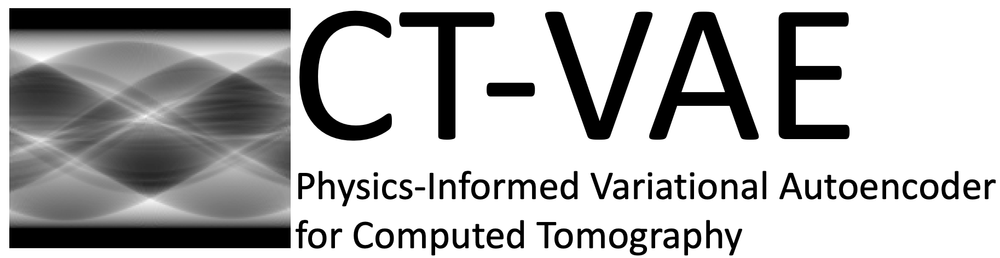
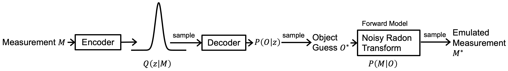

<br/>
<p align="center"></p>

----


`CT_PVAE` is a framework that uses self-supervised learning for computed tomography reconstruction from sparse sinograms (projection measurements). The framework is probabilisitic, inferring a prior distribution from sparse sinograms on a dataset of objects and calculating the posterior for the object reconstruction on each sinogram.

# Overview
The figure below shows the overview of the end-to-end `CT_PVAE` pipeline.

<p align="center"></p>

The main algorithm comprising the `CT_PVAE` is inspired by the variational autoencoder. This repository allows creation of synthetic object datasets and generation of corresponding noisy, sparse sinograms. Object reconstruction from the sparse sinograms is performed with the physics-informed variational autoencoder. Code is included for visualization and comparison of results.  

# Table of contents
1. [Installation](#Installation)
2. [Running End-to-End](#Running)
3. [Reconstruction Algorithm Options](#Options)
4. [Reproducing Paper Figures](#PaperFigures)
   1. [Creating Datasets](#Datasets)
   2. [Reproducing Toy Dataset Results](#ToyDataset)
   3. [Reproducing Foam Dataset Results](#FoamDataset)
   
# Installation <a name="Installation"></a>

First, navigate to the folder where you want the repository and clone the repository:

```
git clone https://github.com/vganapati/CT_PVAE.git
```

Create a `conda` environment:

```
cd CT_PVAE
conda env create -f environment.yml
conda activate CT
```

Once you're done with the above step, you need to use `pip install` to finish installing all the dependencies, using:

```
pip install --upgrade -r requirements_upgrade.txt
pip install -r requirements.txt
pip install -U hpo-uq==1.3.14
```

And you're all set!

# Running End-to-End <a name="Running"></a>

These are instructions to create a small synthetic dataset and quickly check that the code is working. Due to the fast training times and small size of the dataset, reconstruction results are expected to be poor. See [Reproducing Paper Figures](#PaperFigures) for instructions on creating larger datasets and using longer training times.

Activate your environment if not already activated:

```
conda activate CT
```

Navigate to the CT_PVAE directory. 
Next, set your PYTHONPATH to include the current directory:

```
export PYTHONPATH=$PYTHONPATH:$(pwd)
```

Run the following to create a synthetic foam dataset of 50 examples, saved in the subfolder `dataset_foam` of the current directory:

```
python scripts/create_foam_images.py -n 50
python scripts/images_to_sinograms.py -n 50
```

Finally, train the physics-informed variational autoencoder; results are saved in subfolder `ct_vae_test` of the current directory.

```
python bin/main_ct_vae.py --input_path dataset_foam --save_path ct_vae_test -b 5 --pnm 1e4 -i 1000 --td 50 --normal --visualize --nsa 20 --ns 2 --api 20 --pnm_start 1e3 --random --algorithms gridrec --train

```

# Reconstruction Algorithm Options <a name="Options"></a>

There are several options for running the reconstruction algorithm with `python bin/main_ct_vae.py`.

```
usage: main_ct_vae.py [-h] [--ae ADAM_EPSILON] [-b BATCH_SIZE] [--ns NUM_SAMPLES] [--det] [--dp DROPOUT_PROB]
                      [--en EXAMPLE_NUM] [-i NUM_ITER] [--ik INTERMEDIATE_KERNEL] [--il INTERMEDIATE_LAYERS]
                      [--input_path INPUT_PATH] [--klaf KL_ANNEAL_FACTOR] [--klm KL_MULTIPLIER] [--ks KERNEL_SIZE]
                      [--lr LEARNING_RATE] [--nb NUM_BLOCKS] [--nfm NUM_FEATURE_MAPS]
                      [--nfmm NUM_FEATURE_MAPS_MULTIPLIER] [--norm NORM] [--normal] [--nsa NUM_SPARSE_ANGLES]
                      [--api ANGLES_PER_ITER] [--pnm POISSON_NOISE_MULTIPLIER] [--pnm_start PNM_START]
                      [--train_pnm] [-r RESTORE_NUM] [--random] [--restore] [--save_path SAVE_PATH]
                      [--se STRIDE_ENCODE] [--si SAVE_INTERVAL] [--td TRUNCATE_DATASET] [--train] [--ufs] [--ulc]
                      [--visualize] [--pixel_dist] [--real] [--no_pad] [--toy_masks]
                      [--algorithms ALGORITHMS [ALGORITHMS ...]] [--no_final_eval]

Get command line args

optional arguments:
  -h, --help            show this help message and exit
  --ae ADAM_EPSILON     adam_epsilon
  -b BATCH_SIZE         batch size
  --ns NUM_SAMPLES      number of times to sample VAE in training
  --det                 no latent variable, simply maximizes log probability of output_dist
  --dp DROPOUT_PROB     dropout_prob, percentage of nodes that are dropped
  --en EXAMPLE_NUM      example index for visualization
  -i NUM_ITER           number of training iterations
  --ik INTERMEDIATE_KERNEL
                        intermediate_kernel for model_encode
  --il INTERMEDIATE_LAYERS
                        intermediate_layers for model_encode
  --input_path INPUT_PATH
                        path to folder containing training data
  --klaf KL_ANNEAL_FACTOR
                        multiply kl_anneal by this factor each iteration
  --klm KL_MULTIPLIER   multiply the kl_divergence term in the loss function by this factor
  --ks KERNEL_SIZE      kernel size in model_encode_I_m
  --lr LEARNING_RATE    learning rate
  --nb NUM_BLOCKS       num convolution blocks in model_encode
  --nfm NUM_FEATURE_MAPS
                        number of features in the first block of model_encode
  --nfmm NUM_FEATURE_MAPS_MULTIPLIER
                        multiplier of features for each block of model_encode
  --norm NORM           gradient clipping by norm
  --normal              use a normal distribution as final distribution
  --nsa NUM_SPARSE_ANGLES
                        number of angles to image per sample (dose remains the same)
  --api ANGLES_PER_ITER
                        number of angles to check per iteration (stochastic optimization)
  --pnm POISSON_NOISE_MULTIPLIER
                        poisson noise multiplier, higher value means higher SNR
  --pnm_start PNM_START
                        poisson noise multiplier starting value, anneals to pnm value
  --train_pnm           if True, make poisson_noise_multiplier a trainable variable
  -r RESTORE_NUM        checkpoint number to restore from
  --random              if True, randomly pick angles for masks
  --restore             restore from previous training
  --save_path SAVE_PATH
                        path to save output
  --se STRIDE_ENCODE    convolution stride in model_encode_I_m
  --si SAVE_INTERVAL    save_interval for checkpoints and intermediate values
  --td TRUNCATE_DATASET
                        truncate_dataset by this value to not load in entire dataset; overriden when restoring a
                        net
  --train               run the training loop
  --ufs                 use the first skip connection in the unet
  --ulc                 uses latest checkpoint, overrides -r
  --visualize           visualize results
  --pixel_dist          get distribution of each pixel in final reconstruction
  --real                denotes real data, does not simulate noise
  --no_pad              sinograms have no zero-padding
  --toy_masks           uses the toy masks
  --algorithms ALGORITHMS [ALGORITHMS ...]
                        list of initial algorithms to use
  --no_final_eval       skips the final evaluation
```

# Reproducing Paper Figures <a name="PaperFigures"></a>

## Creating Datasets <a name="Datasets"></a>

Run the following once to create the datasets (both `dataset_toy` and `dataset_foam`):

Activate your environment if not already activated:

```
conda activate CT
```

Navigate to the CT_PVAE directory. 
Next, set your PYTHONPATH to include the current directory:

```
export PYTHONPATH=$PYTHONPATH:$(pwd)
```

Run the following to create a synthetic foam dataset of 1,000 examples, saved in the subfolder `dataset_foam` of the current directory:

```
python scripts/create_foam_images.py -n 1000
python scripts/images_to_sinograms.py -n 1000
```

Run the following to create a synthetic toy dataset of 1,024 examples, saved in the subfolder `dataset_toy_discrete2` of the current directory:

```
- python scripts/create_toy_images.py -n 1024
- python scripts/images_to_sinograms.py -n 1024 --toy
```

## Reproducing Toy Dataset Results <a name="ToyDataset"></a>

Train the physics-informed variational autoencoder with the following options:

```
python bin/main_ct_vae.py --input_path dataset_toy_discrete2 --save_path toy_vae -b 4 --pnm 10000 -i 100000 --td 1024 --train --nsa 1 --ik 2 --il 5 --ks 2 --nb 3 --api 2 --se 1 --no_pad --ns 10 --pnm_start 1000 --si 100000 --normal --visualize --toy_masks

```

To create marginal posterior probability distributions for each pixel, results saved in the subfolder `toy_vae` of the current directory:

```
python bin/main_ct_vae.py --input_path dataset_toy_discrete2 --save_path toy_vae -b 4 --pnm 10000 -i 100000 --td 1024 --nsa 1 --ik 2 --il 5 --ks 2 --nb 3 --api 2 --se 1 --no_pad --ns 10 --pnm_start 1000 --si 100000 --normal --visualize --toy_masks --pixel_dist --restore --ulc --en 0

python bin/main_ct_vae.py --input_path dataset_toy_discrete2 --save_path toy_vae -b 4 --pnm 10000 -i 100000 --td 1024 --nsa 1 --ik 2 --il 5 --ks 2 --nb 3 --api 2 --se 1 --no_pad --ns 10 --pnm_start 1000 --si 100000 --normal --visualize --toy_masks --pixel_dist --restore --ulc --en 1

python bin/main_ct_vae.py --input_path dataset_toy_discrete2 --save_path toy_vae -b 4 --pnm 10000 -i 100000 --td 1024 --nsa 1 --ik 2 --il 5 --ks 2 --nb 3 --api 2 --se 1 --no_pad --ns 10 --pnm_start 1000 --si 100000 --normal --visualize --toy_masks --pixel_dist --restore --ulc --en 2

python bin/main_ct_vae.py --input_path dataset_toy_discrete2 --save_path toy_vae -b 4 --pnm 10000 -i 100000 --td 1024 --nsa 1 --ik 2 --il 5 --ks 2 --nb 3 --api 2 --se 1 --no_pad --ns 10 --pnm_start 1000 --si 100000 --normal --visualize --toy_masks --pixel_dist --restore --ulc --en 3
```


## Reproducing Foam Dataset Results <a name="FoamDataset"></a>

Train the physics-informed variational autoencoder with the following options, results saved in the subfolder `foam_vae` of the current directory:

```
python bin/main_ct_vae.py --input_path dataset_foam --save_path foam_vae -b 10 --pnm 10000 -i 100000 --td 1000 --normal --visualize --nsa 20 --ns 2 --api 20 --pnm_start 1000 --si 100000 --random --algorithms sirt tv fbp gridrec --train
```


